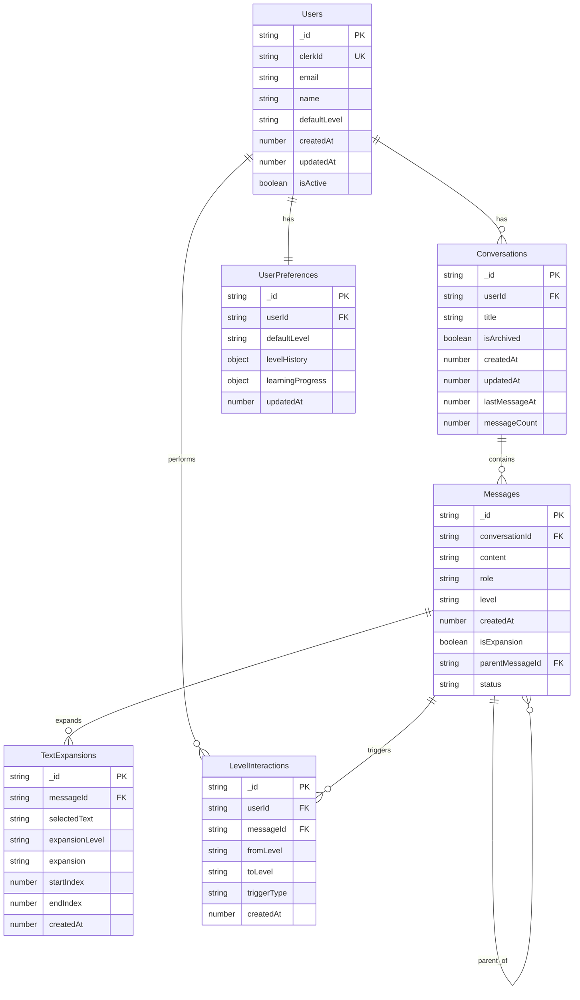

# Database Schema Documentation

This document describes the database schema for the ELI5 Learning Application using Convex.

## 📊 Schema Overview

The database follows a normalized structure optimized for real-time updates and educational content management. All tables use Convex's built-in `_id` field as the primary key.

## 🗃️ Tables

### 1. Users

Stores user account information and preferences.

```typescript
// convex/schema.ts
users: defineTable({
  clerkId: v.string(),           // Clerk user ID (unique)
  email: v.string(),             // User email address
  name: v.optional(v.string()),  // Display name
  defaultLevel: v.string(),      // Default explanation level
  createdAt: v.number(),         // Timestamp
  updatedAt: v.number(),         // Timestamp
  isActive: v.boolean(),         // Account status
  preferences: v.optional(v.object({
    theme: v.string(),           // UI theme preference
    autoAdvance: v.boolean(),    // Auto-advance level setting
    notifications: v.boolean(),   // Notification preferences
  }))
})
.index("clerkId", ["clerkId"])   // Unique index on Clerk ID
.index("email", ["email"])       // Index for email lookups
```

**Relationships:**
- One-to-many with `conversations`
- One-to-one with `userPreferences` (embedded)
- One-to-many with `levelInteractions`

### 2. Conversations

Represents chat sessions/conversations.

```typescript
conversations: defineTable({
  userId: v.id("users"),         // Foreign key to users
  title: v.string(),             // Conversation title (auto-generated or user-set)
  description: v.optional(v.string()), // Optional description
  isArchived: v.boolean(),       // Archive status
  createdAt: v.number(),         // Timestamp
  updatedAt: v.number(),         // Timestamp
  lastMessageAt: v.optional(v.number()), // Last message timestamp
  messageCount: v.number(),      // Cached message count
  tags: v.optional(v.array(v.string())), // User-defined tags
})
.index("userId", ["userId"])               // Index for user's conversations
.index("userId_lastMessage", ["userId", "lastMessageAt"]) // For chronological sorting
.index("userId_archived", ["userId", "isArchived"])       // Filter archived
```

**Relationships:**
- Many-to-one with `users`
- One-to-many with `messages`

### 3. Messages

Stores all chat messages (both user and AI).

```typescript
messages: defineTable({
  conversationId: v.id("conversations"), // Foreign key to conversations
  content: v.string(),                   // Message content
  role: v.union(                         // Message type
    v.literal("user"),
    v.literal("assistant"),
    v.literal("system")
  ),
  level: v.optional(v.string()),         // Education level (for AI responses)
  metadata: v.optional(v.object({
    tokenCount: v.optional(v.number()),  // Token usage
    processingTime: v.optional(v.number()), // AI processing time
    model: v.optional(v.string()),       // AI model used
    confidence: v.optional(v.number()),  // AI confidence score
  })),
  createdAt: v.number(),                 // Timestamp
  isExpansion: v.boolean(),              // Is this an expansion of another message
  parentMessageId: v.optional(v.id("messages")), // Parent message for expansions
  status: v.union(                       // Message status
    v.literal("pending"),
    v.literal("complete"),
    v.literal("error")
  ),
  errorMessage: v.optional(v.string()),  // Error details if status is error
})
.index("conversationId", ["conversationId"])           // Messages in conversation
.index("conversationId_createdAt", ["conversationId", "createdAt"]) // Chronological
.index("parentMessageId", ["parentMessageId"])         // Expansions
.index("role_level", ["role", "level"])               // AI messages by level
```

**Relationships:**
- Many-to-one with `conversations`
- One-to-many with `textExpansions`
- One-to-many with `levelInteractions`
- Self-referencing for expansions (`parentMessageId`)

### 4. TextExpansions

Tracks when users expand specific text within explanations.

```typescript
textExpansions: defineTable({
  messageId: v.id("messages"),           // Source message
  selectedText: v.string(),              // The highlighted text
  expansionLevel: v.string(),            // Level requested for expansion
  expansion: v.string(),                 // AI-generated expansion
  startIndex: v.number(),                // Start position in original text
  endIndex: v.number(),                  // End position in original text
  createdAt: v.number(),                 // Timestamp
  userId: v.optional(v.id("users")),     // User who requested expansion
})
.index("messageId", ["messageId"])       // Expansions for a message
.index("userId", ["userId"])             // User's expansion history
.index("selectedText", ["selectedText"]) // Common expansion terms
```

**Relationships:**
- Many-to-one with `messages`
- Many-to-one with `users`

### 5. LevelInteractions

Tracks when users change explanation levels.

```typescript
levelInteractions: defineTable({
  userId: v.id("users"),                 // User who made the change
  messageId: v.id("messages"),           // Message that was re-leveled
  fromLevel: v.string(),                 // Original level
  toLevel: v.string(),                   // New level
  triggerType: v.union(                  // How the change was triggered
    v.literal("dropdown"),               // Level dropdown selection
    v.literal("auto_advance"),           // Automatic advancement
    v.literal("suggestion")              // System suggestion
  ),
  createdAt: v.number(),                 // Timestamp
  sessionId: v.optional(v.string()),     // Session identifier
})
.index("userId", ["userId"])                    // User's level changes
.index("messageId", ["messageId"])              // Level changes for message
.index("userId_createdAt", ["userId", "createdAt"]) // Chronological user activity
.index("fromLevel_toLevel", ["fromLevel", "toLevel"]) // Level transition patterns
```

**Relationships:**
- Many-to-one with `users`
- Many-to-one with `messages`

### 6. UserPreferences

Extended user preferences and learning analytics.

```typescript
userPreferences: defineTable({
  userId: v.id("users"),                 // Foreign key to users
  defaultLevel: v.string(),              // Default explanation level
  levelHistory: v.object({               // Level usage statistics
    preschool: v.number(),
    elementary: v.number(),
    middle: v.number(),
    high: v.number(),
    college: v.number(),
    phd: v.number(),
  }),
  learningProgress: v.object({
    totalInteractions: v.number(),       // Total chat interactions
    levelsAdvanced: v.number(),          // Number of level advancements
    avgSessionDuration: v.number(),      // Average session length
    favoriteTopics: v.array(v.string()), // Most discussed topics
    lastActiveAt: v.number(),            // Last activity timestamp
  }),
  streakData: v.object({
    currentStreak: v.number(),           // Current daily usage streak
    longestStreak: v.number(),           // Longest streak achieved
    lastStreakDate: v.number(),          // Last streak activity
  }),
  achievements: v.optional(v.array(v.object({
    type: v.string(),                    // Achievement type
    unlockedAt: v.number(),              // When unlocked
    level: v.optional(v.string()),       // Associated level if applicable
  }))),
  updatedAt: v.number(),                 // Timestamp
})
.index("userId", ["userId"])             // One per user
```

**Relationships:**
- One-to-one with `users`

### 7. Sessions (Optional - for analytics)

Tracks user sessions for analytics purposes.

```typescript
sessions: defineTable({
  userId: v.optional(v.id("users")),     // User (null for guest sessions)
  sessionId: v.string(),                 // Unique session identifier
  startedAt: v.number(),                 // Session start time
  endedAt: v.optional(v.number()),       // Session end time
  duration: v.optional(v.number()),      // Session duration in seconds
  messageCount: v.number(),              // Messages in this session
  levelsUsed: v.array(v.string()),       // Levels accessed in session
  device: v.optional(v.string()),        // Device type
  userAgent: v.optional(v.string()),     // Browser information
})
.index("userId", ["userId"])             // User's sessions
.index("sessionId", ["sessionId"])       // Unique session lookup
.index("startedAt", ["startedAt"])       // Chronological sessions
```

---

## 🔑 Indexes

### Primary Indexes
- All tables have implicit `_id` primary key
- `users.clerkId` - Unique identifier from Clerk
- `sessions.sessionId` - Unique session tracking

### Query Optimization Indexes
- `conversations.userId_lastMessage` - Recent conversations
- `messages.conversationId_createdAt` - Message chronology
- `levelInteractions.userId_createdAt` - User activity timeline
- `userPreferences.userId` - One-to-one relationship optimization

### Analytics Indexes
- `levelInteractions.fromLevel_toLevel` - Level transition analysis
- `messages.role_level` - AI response analysis
- `textExpansions.selectedText` - Popular expansion terms

---

## 🔄 Data Relationships

### Entity Relationship Diagram



---

## 📏 Data Validation

### Field Constraints

```typescript
// Education levels enum
const EDUCATION_LEVELS = [
  "preschool",
  "elementary", 
  "middle",
  "high",
  "college",
  "phd"
] as const;

// Message roles
const MESSAGE_ROLES = ["user", "assistant", "system"] as const;

// Message status
const MESSAGE_STATUS = ["pending", "complete", "error"] as const;

// Trigger types for level interactions
const TRIGGER_TYPES = ["dropdown", "auto_advance", "suggestion"] as const;
```

### Business Rules

1. **User Constraints**
   - `clerkId` must be unique across all users
   - `email` must be valid email format
   - `defaultLevel` must be one of the defined education levels

2. **Message Constraints**
   - `content` cannot be empty
   - `level` required for assistant messages
   - `parentMessageId` only valid for expansion messages
   - `role` determines required fields

3. **Conversation Constraints**
   - `userId` must reference existing user
   - `messageCount` should match actual message count
   - `lastMessageAt` should match latest message timestamp

4. **Level Interaction Constraints**
   - `fromLevel` and `toLevel` must be different
   - Both levels must be valid education levels
   - `userId` must reference existing user

---

## 🚀 Query Patterns

### Common Queries

```typescript
// Get user's recent conversations
const recentConversations = await ctx.db
  .query("conversations")
  .withIndex("userId_lastMessage", q => 
    q.eq("userId", userId)
  )
  .order("desc")
  .take(10);

// Get messages in a conversation
const messages = await ctx.db
  .query("messages")
  .withIndex("conversationId_createdAt", q =>
    q.eq("conversationId", conversationId)
  )
  .order("asc")
  .collect();

// Get user's level progression
const levelInteractions = await ctx.db
  .query("levelInteractions")
  .withIndex("userId_createdAt", q =>
    q.eq("userId", userId)
  )
  .order("desc")
  .take(50);

// Find popular expansion terms
const popularExpansions = await ctx.db
  .query("textExpansions")
  .withIndex("selectedText")
  .collect();
```

### Performance Considerations

1. **Pagination**: Use cursor-based pagination for large result sets
2. **Caching**: Cache frequently accessed user preferences
3. **Aggregation**: Pre-calculate stats like message counts
4. **Indexing**: Ensure all query patterns have appropriate indexes

---

## 🔒 Security & Privacy

### Data Access Control

1. **User Isolation**: Users can only access their own data
2. **Guest Users**: Limited access, no persistent data
3. **Admin Access**: Separate admin roles for system management

### Privacy Considerations

1. **Data Minimization**: Only store necessary user information
2. **Encryption**: Sensitive data encrypted at rest
3. **Retention**: Implement data retention policies
4. **Anonymization**: Option to anonymize user data

### Authentication Integration

```typescript
// Example of authenticated query
export const getUserConversations = query({
  args: {},
  handler: async (ctx) => {
    const identity = await ctx.auth.getUserIdentity();
    if (!identity) throw new Error("Unauthorized");
    
    const user = await ctx.db
      .query("users")
      .withIndex("clerkId", q => q.eq("clerkId", identity.subject))
      .unique();
    
    if (!user) throw new Error("User not found");
    
    return await ctx.db
      .query("conversations")
      .withIndex("userId", q => q.eq("userId", user._id))
      .collect();
  },
});
```

---

## 📊 Migration Strategy

### Schema Evolution

1. **Additive Changes**: New fields with optional values
2. **Breaking Changes**: Versioned migration functions
3. **Data Backfill**: Populate new fields with default values
4. **Index Updates**: Add new indexes without downtime

### Migration Examples

```typescript
// Example migration for adding new field
export const migrateUserPreferences = internalMutation({
  args: {},
  handler: async (ctx) => {
    const users = await ctx.db.query("users").collect();
    
    for (const user of users) {
      if (!user.preferences) {
        await ctx.db.patch(user._id, {
          preferences: {
            theme: "light",
            autoAdvance: false,
            notifications: true,
          }
        });
      }
    }
  },
});
```

---

## 🔍 Monitoring & Analytics

### Key Metrics to Track

1. **Usage Metrics**
   - Daily/Monthly active users
   - Messages per session
   - Session duration
   - Level distribution usage

2. **Performance Metrics**
   - Query response times
   - Database size growth
   - Index usage statistics
   - Error rates

3. **Learning Metrics**
   - Level progression patterns
   - Popular expansion terms
   - User retention rates
   - Feature adoption rates

### Health Checks

```typescript
// Database health check query
export const healthCheck = query({
  args: {},
  handler: async (ctx) => {
    const userCount = await ctx.db.query("users").collect().then(r => r.length);
    const activeConversations = await ctx.db
      .query("conversations")
      .filter(q => q.eq(q.field("isArchived"), false))
      .collect()
      .then(r => r.length);
    
    return {
      userCount,
      activeConversations,
      timestamp: Date.now(),
      status: "healthy"
    };
  },
});
``` 