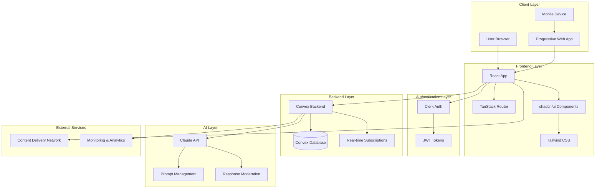
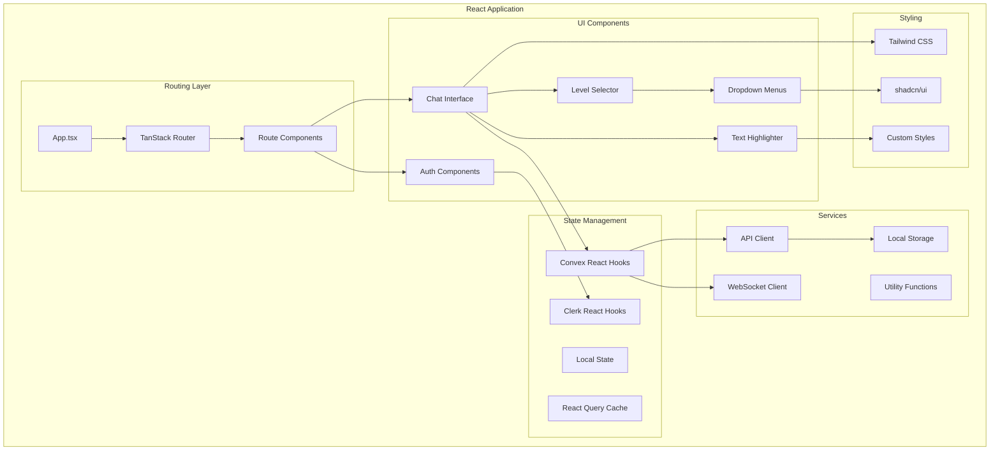
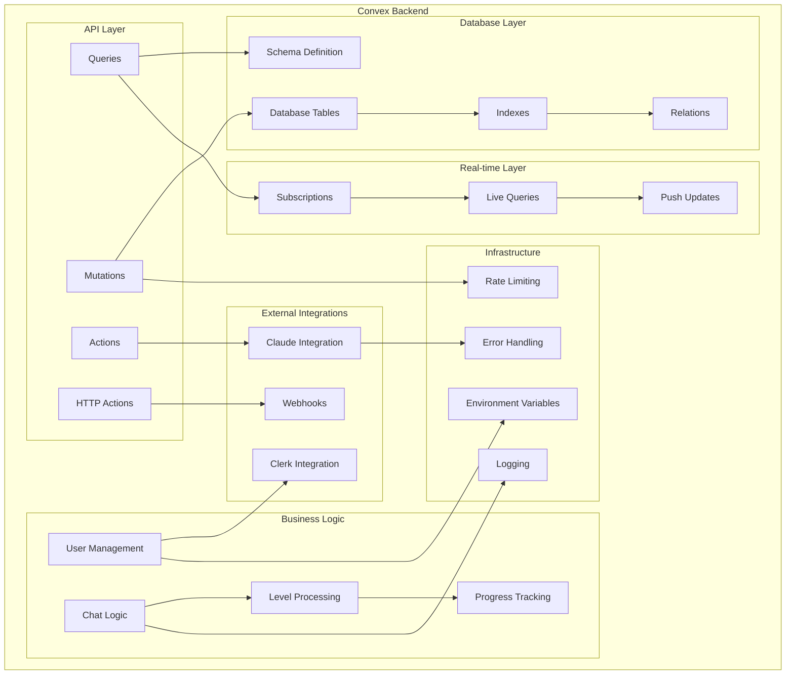
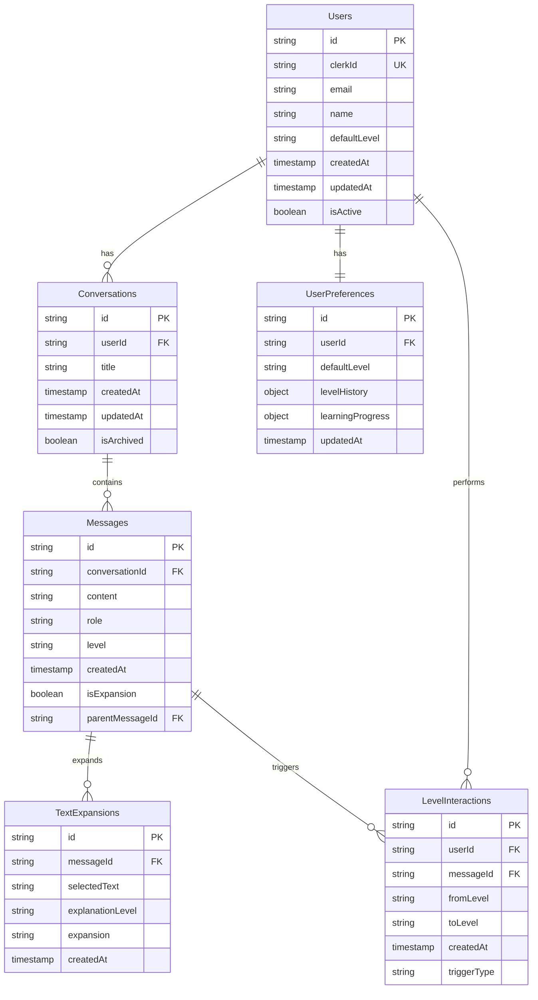
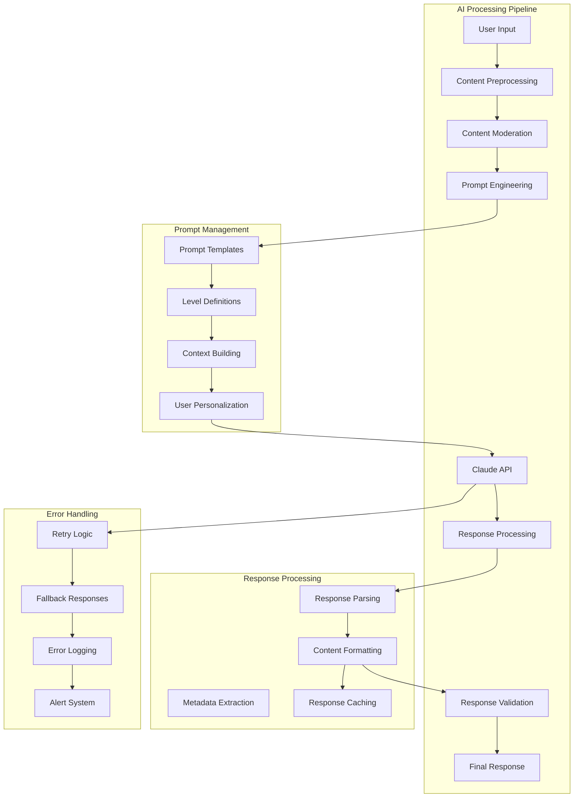
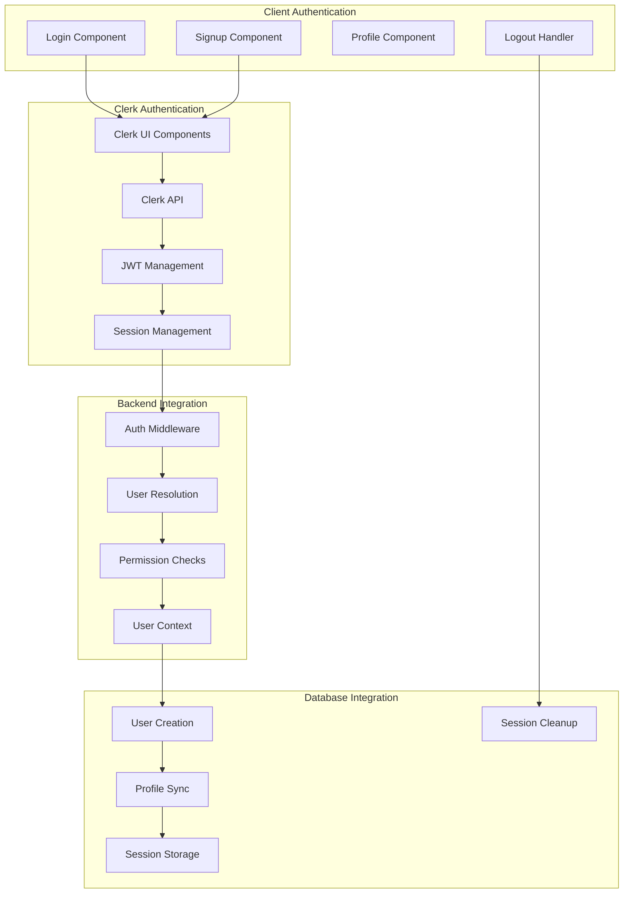
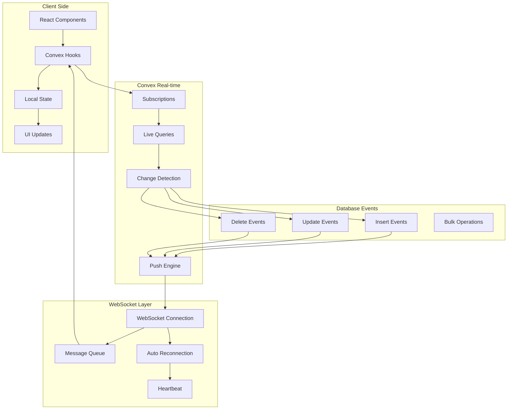
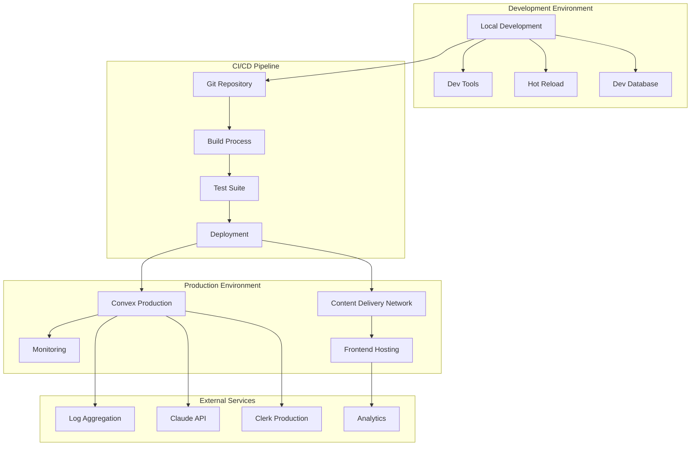
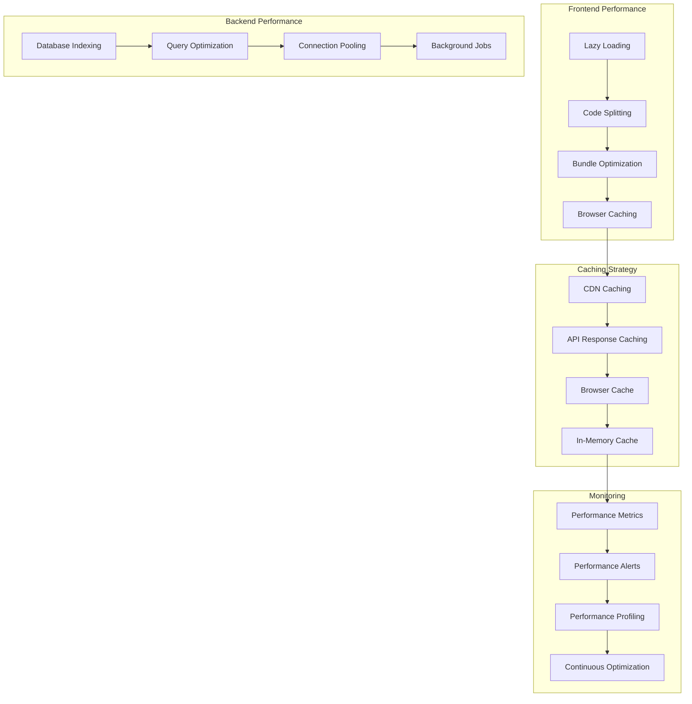

# Architecture Diagrams

This document contains architectural diagrams showing the system design and component relationships of the ELI5 Learning Application.

## 1. High-Level System Architecture

## 2. Frontend Architecture

## 3. Backend Architecture (Convex)

## 4. Database Schema Architecture

## 5. AI Integration Architecture

## 6. Authentication Flow Architecture

## 7. Real-time Data Flow

## 8. Deployment Architecture

## 9. Security Architecture

```mermaid
graph TB
    subgraph "Frontend Security"
        CSP[Content Security Policy]
        XSS[XSS Protection]
        CORS[CORS Configuration]
        HTTPS[HTTPS Enforcement]
    end
    
    subgraph "Authentication Security"
        JWT_VERIFY[JWT Verification]
        SESSION_MGMT[Session Management]
        MFA[Multi-Factor Auth]
        RATE_LIMIT[Rate Limiting]
    end
    
    subgraph "API Security"
        INPUT_VALID[Input Validation]
        OUTPUT_SANITIZE[Output Sanitization]
        SQL_INJECT[SQL Injection Prevention]
        API_KEY[API Key Management]
    end
    
    subgraph "Data Security"
        ENCRYPTION[Data Encryption]
        PRIVACY[Privacy Controls]
        GDPR[GDPR Compliance]
        BACKUP[Secure Backups]
    end
    
    subgraph "Infrastructure Security"
        FIREWALL[Firewall Rules]
        MONITORING[Security Monitoring]
        LOGGING[Audit Logging]
        INCIDENT[Incident Response]
    end
    
    CSP --> XSS
    XSS --> CORS
    CORS --> HTTPS
    HTTPS --> JWT_VERIFY
    JWT_VERIFY --> SESSION_MGMT
    SESSION_MGMT --> MFA
    MFA --> RATE_LIMIT
    RATE_LIMIT --> INPUT_VALID
    INPUT_VALID --> OUTPUT_SANITIZE
    OUTPUT_SANITIZE --> SQL_INJECT
    SQL_INJECT --> API_KEY
    API_KEY --> ENCRYPTION
    ENCRYPTION --> PRIVACY
    PRIVACY --> GDPR
    GDPR --> BACKUP
    BACKUP --> FIREWALL
    FIREWALL --> MONITORING
    MONITORING --> LOGGING
    LOGGING --> INCIDENT
```

## 10. Performance Architecture

