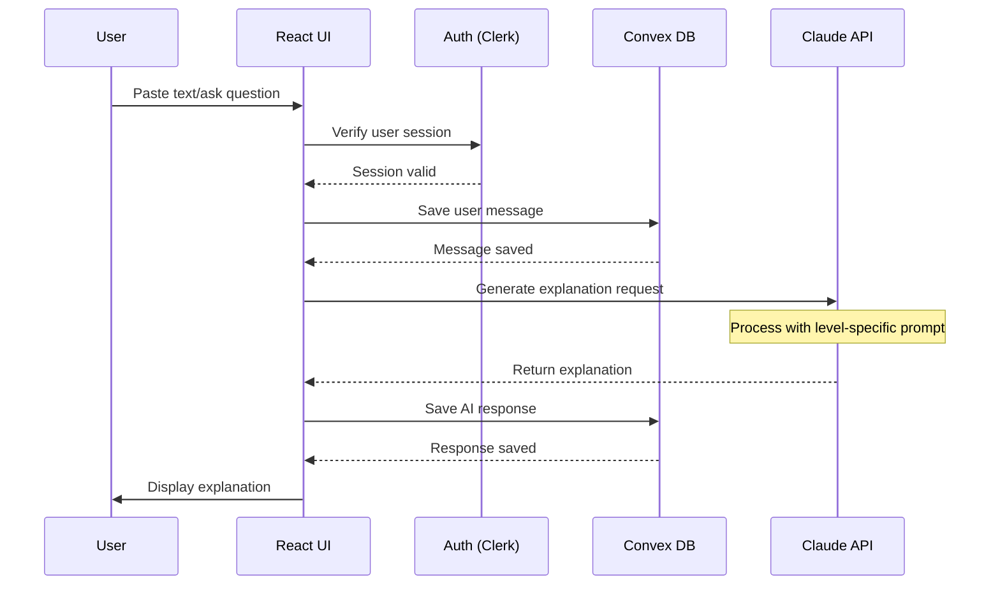
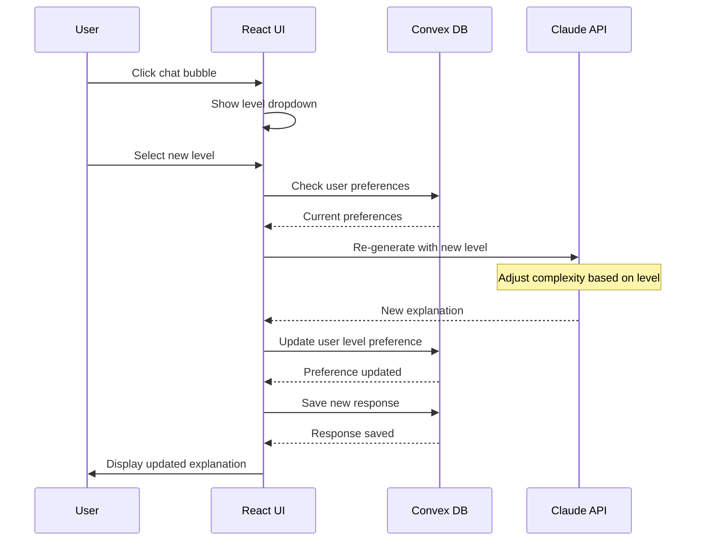
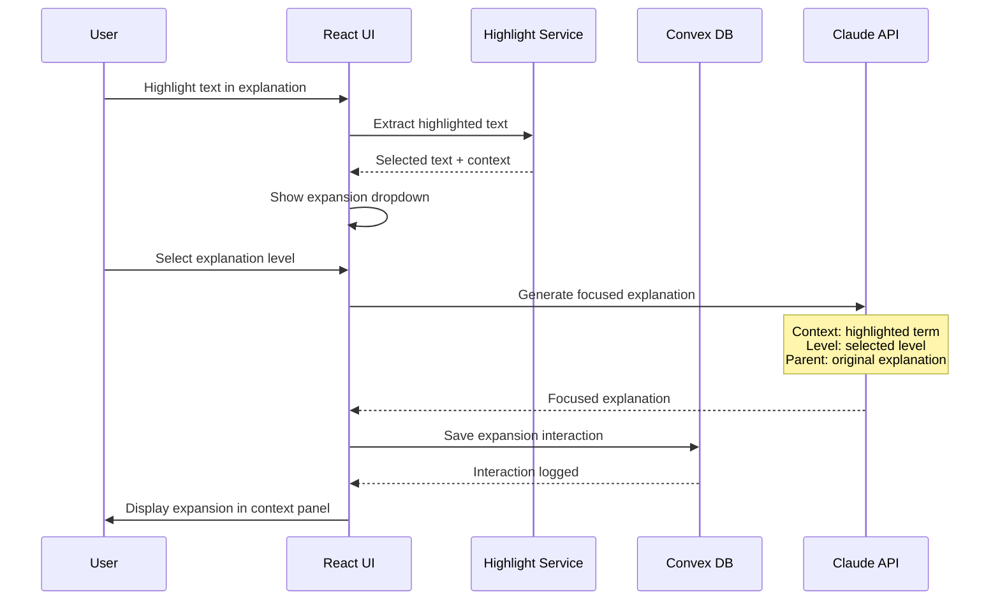
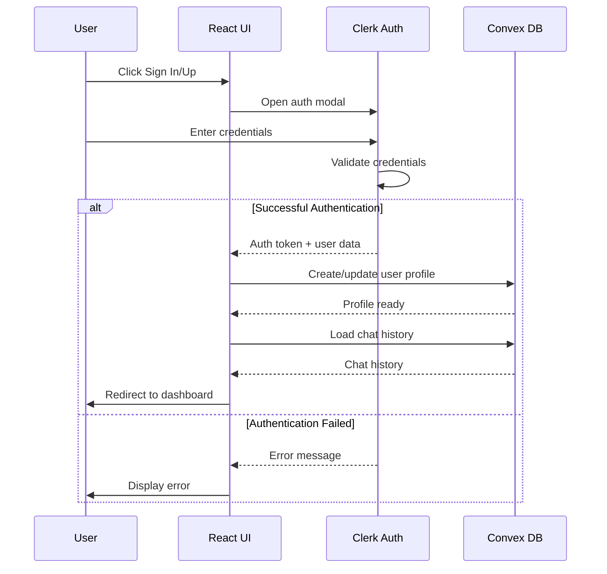
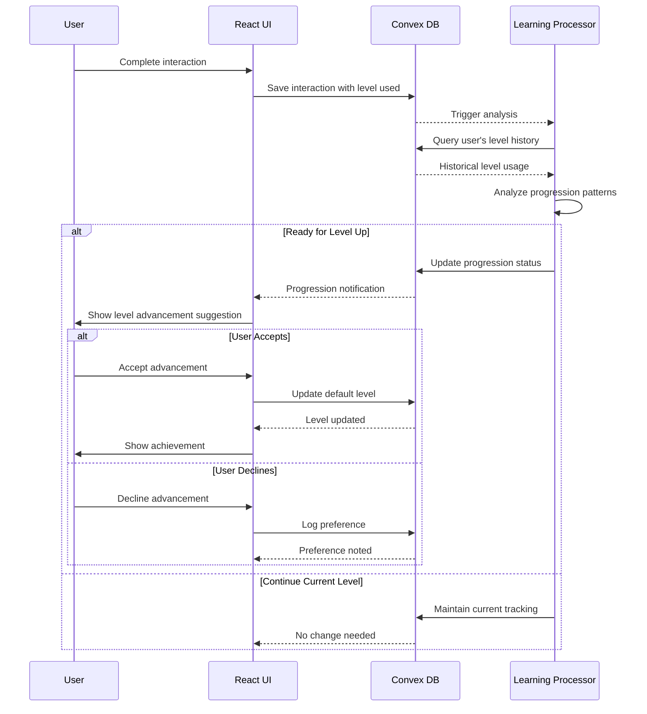
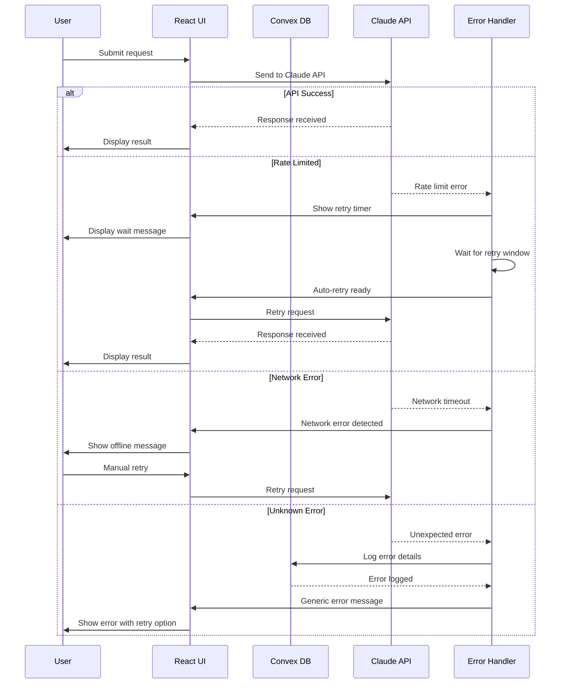
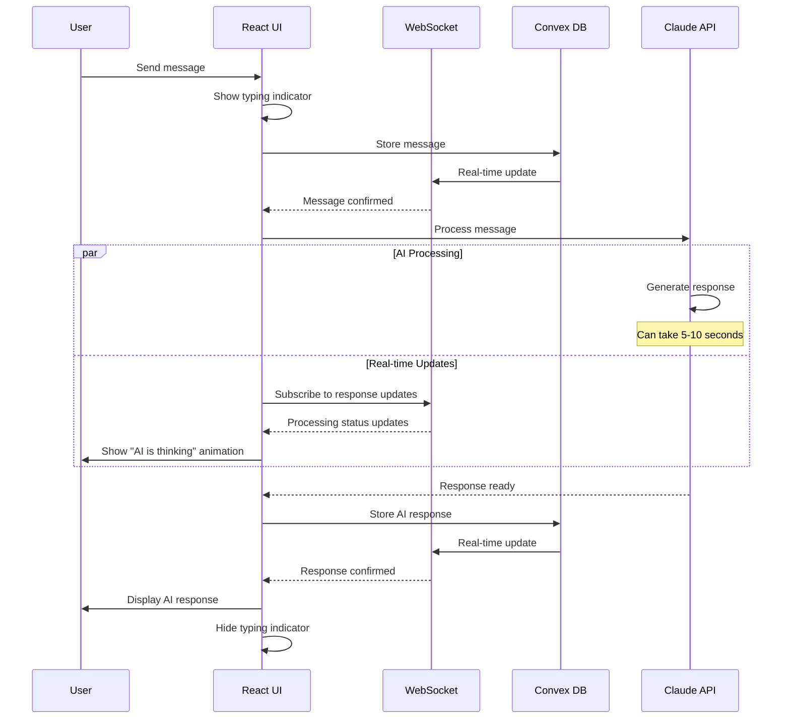
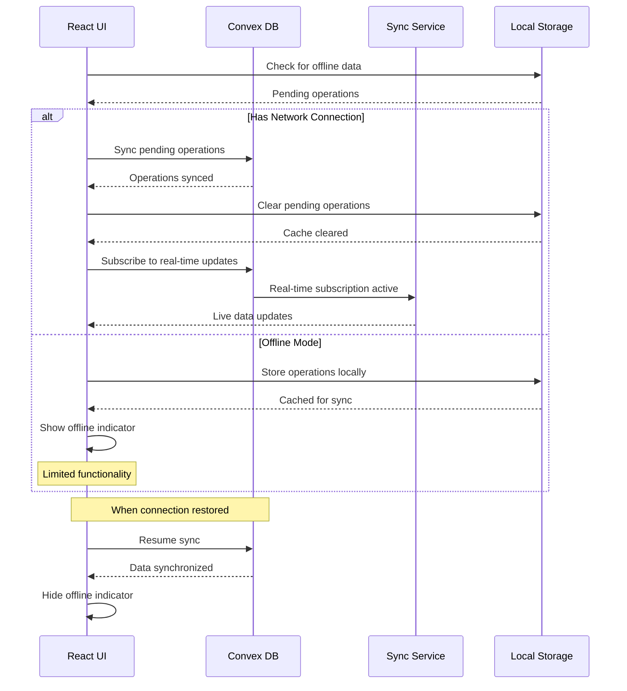
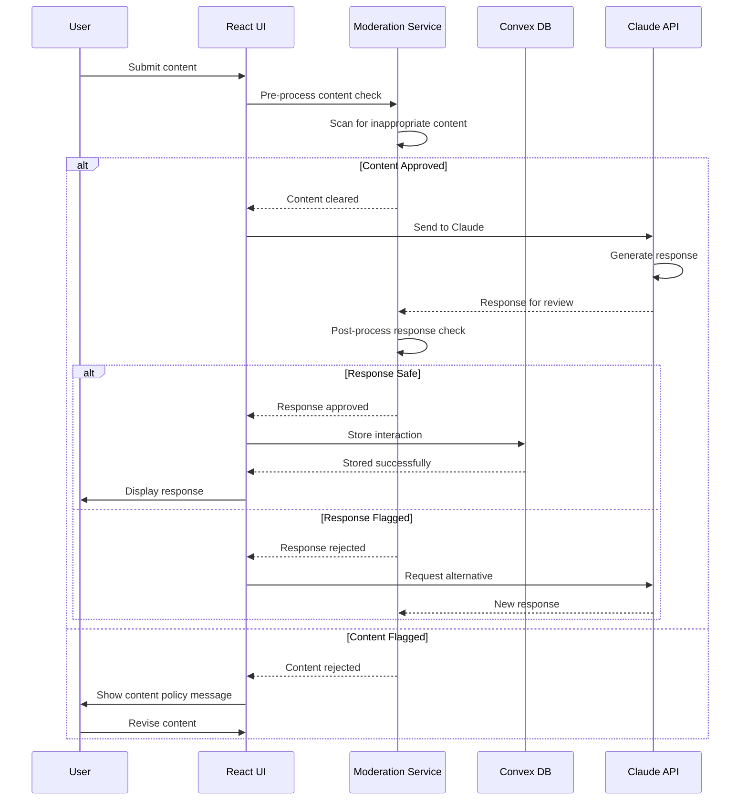
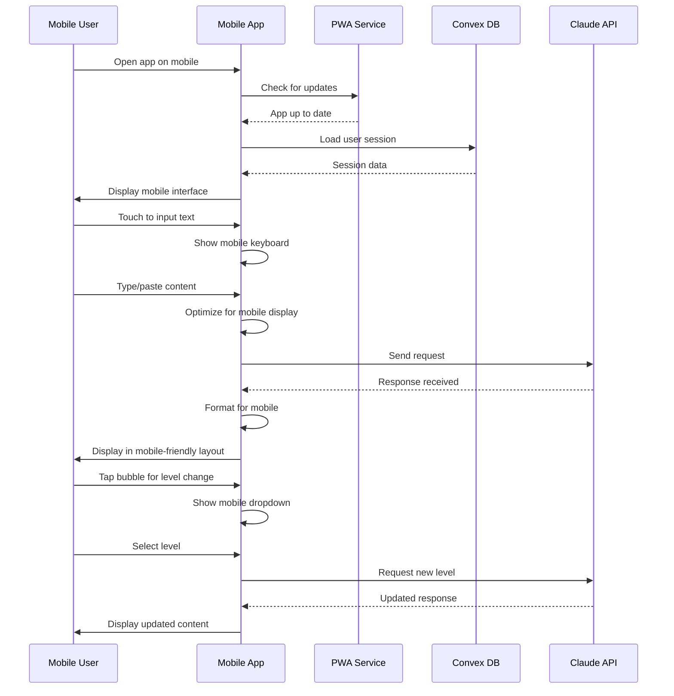

# Sequence Diagrams

This document contains sequence diagrams showing the interactions between different components of the ELI5 Learning Application.

## 1. Basic Explanation Request

## 2. Level Adjustment Sequence

## 3. Text Expansion Sequence

## 4. User Authentication Flow

## 5. Learning Progression Tracking

## 6. Error Handling and Retry Logic

## 7. Real-time Chat Interface

## 8. Data Synchronization

## 9. Content Moderation Pipeline

## 10. Mobile App Sequence

