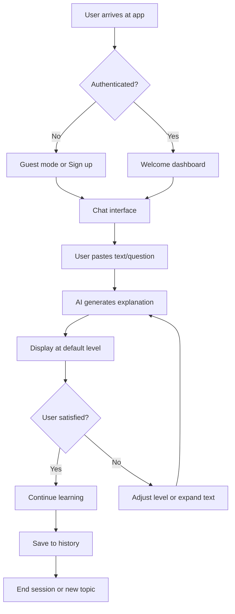
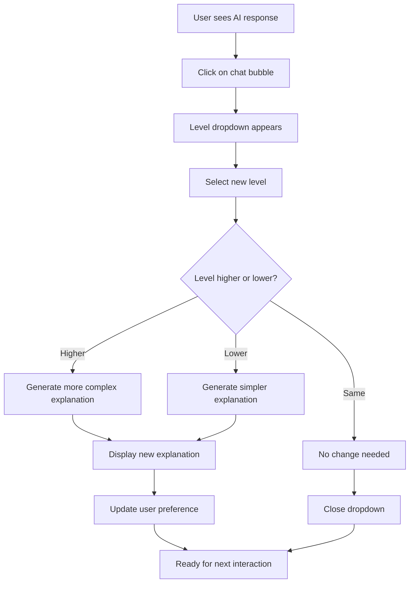
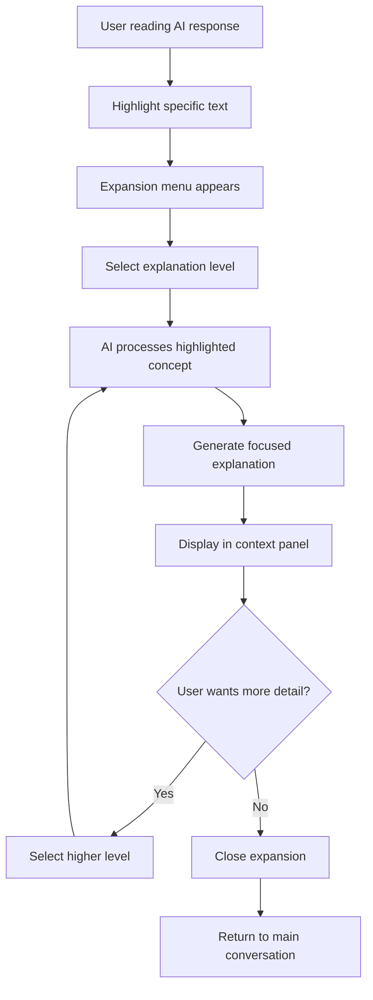
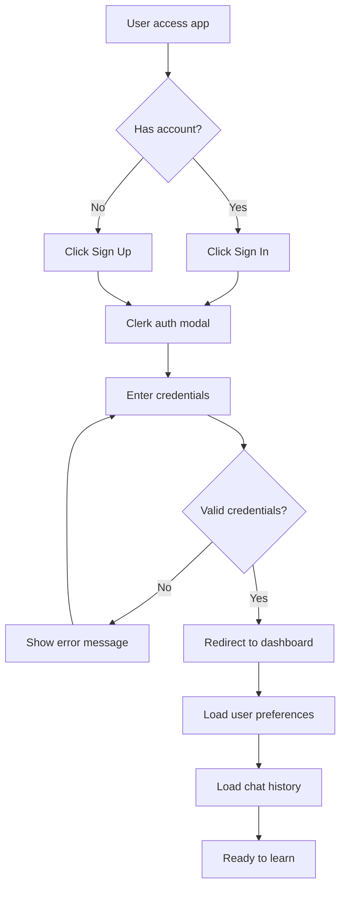
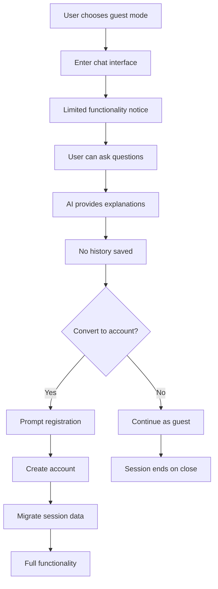
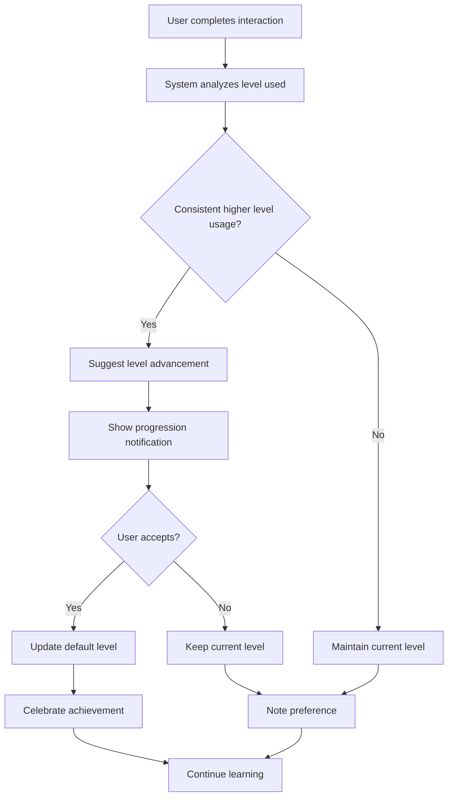
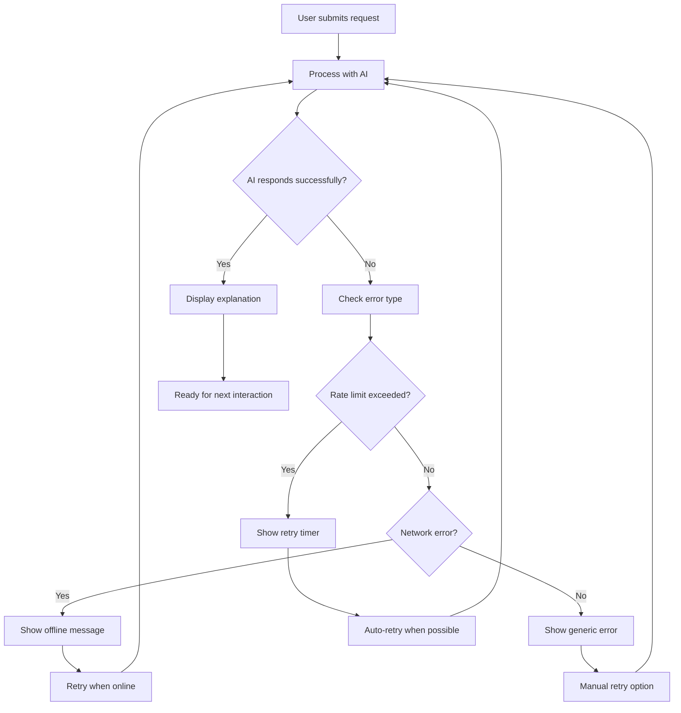
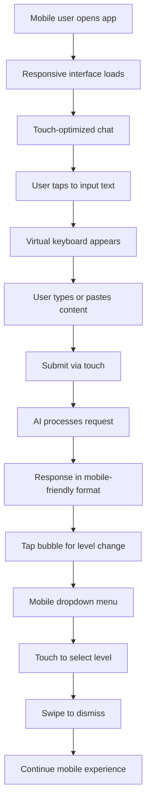
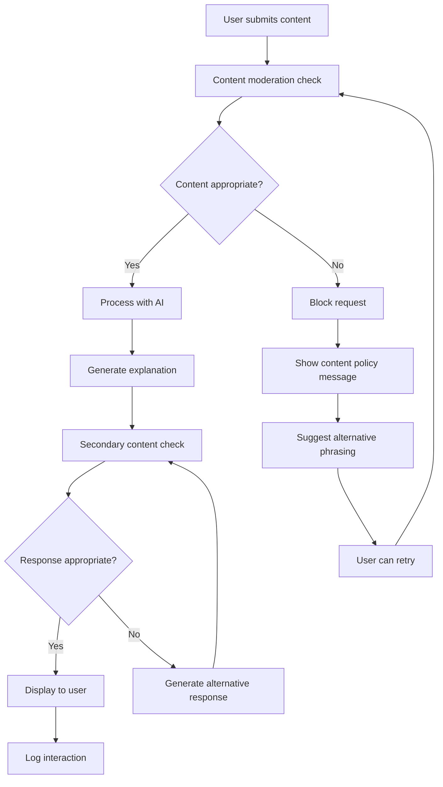
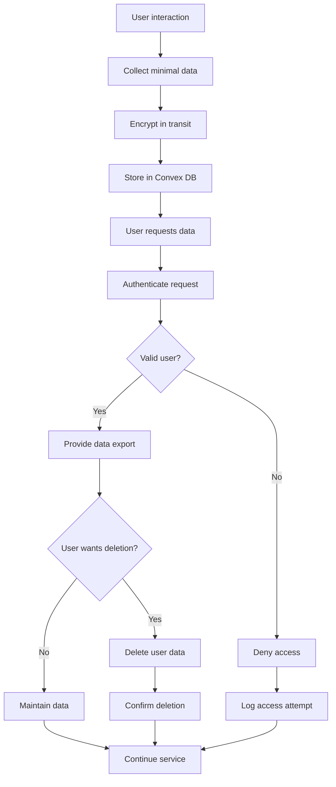

# User Flow Diagrams

This document contains Mermaid diagrams showing the various user flows through the ELI5 Learning Application.

## 1. Primary User Journey

## 2. Level Adjustment Flow

## 3. Text Expansion Flow

## 4. Authentication Flow

## 5. Guest Mode Flow

## 6. Learning Progression Flow

## 7. Error Handling Flow

## 8. Mobile User Flow

## 9. Content Moderation Flow

## 10. Data Privacy Flow

